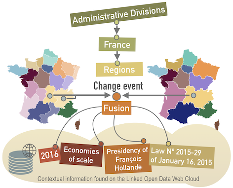
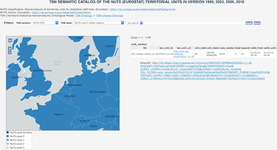

## Welcome to the TSN-Project documentation

**TSNs (*Territorial Statistical Nomenclatures*) are geographic divisions built by Statistical Institutes**, usually deriving from electoral or administrative structure.
TSNs geographic divisions change over time. 
 
The **TSN and TSN-Change Ontologies** (Territorial Statistical Nomenclature Ontology)  enable the description of any geographic divisions for statistics into the Web of Linked Data and, above all, rich descriptions of territorial changes from one geographic divisions version to another.

*Through times, all over the world, the areas (portions of space on earth) delimited by or, under the control of human groups (e.g., administrative or electoral areas) are subject to change : their names, belonging or boundaries change for some political or administrative reasons. Likewise, the Territorial Statistical Nomenclatures (TSNs) that are sets of artifact areas built by Statistical Institutes, and usually deriving from electoral or administrative structures, also change over time and at several division levels (e.g., regions, districts, sub-districts). These changes in TSNs are an obstacle to maintain socio-economic data comparability over time. Since most of the time, they lead to broken time-series and are source of misinterpretations of statistics when not properly documented.*

This phenomenon is very frequent in Europe (for instance in France, in 2016, administrative regions have been merged into greater regions) or in the U.S.A. (through a well-known process called gerrymandering).

We propose the following representation of TSN changes on the Linked Open Data Web:

### TSN Papers 

 * **Modeling changes in territorial partitions over time: Ontologies TSN and TSN-Change** Bernard C., Villanova-Oliver M., Gensel J., Dao H. 
 The 33rd ACM/SIGAPP Symposium On Applied Computing **ACM SIGAPP 2018**, April 9–13, 2018, Pau, France.
 
 * **An Ontology-based Algorithm for Managing the Evolution of Multi-Level Territorial Partitions** Bernard C., Plumejeaud-Perreau C., Villanova-Oliver M., Gensel J., Dao H. 
The 26th ACM/SIGSPATIAL International Conference on Advances in Geographic Information Systems, **ACM SIGSPATIAL 2018**, November 6-9, 2018, Seattle, Washington, USA. 
**BEST POSTER AWARD** [https://sigspatial2018.sigspatial.org/awards/](https://sigspatial2018.sigspatial.org/awards/)

### Ontologies

TSN Ontology [http://purl.org/net/tsn#](http://purl.org/net/tsn#) 

TSN-Change Ontology [http://purl.org/net/tsnchange#](http://purl.org/net/tsnchange#) 

### TSN Datasets

**Eurostat Nomenclature NUTS** versions 1999, 2003, 2006, 2010 [http://purl.org/steamer/nuts/](http://purl.org/steamer/nuts/) 

**Australian Nomenclature ASGS** versions 2011, 2016 [http://purl.org/steamer/asgs/](http://purl.org/steamer/asgs/) 

**Swiss Nomenclature SAU** versions 2017, 2018 [http://purl.org/steamer/sau/](http://purl.org/steamer/sau/) 

### TSN-Change Datasets

 * NUTS change graphs 
 
     * versions 1999 to 2003 
     [http://purl.org/steamer/nuts/change_nomenclaturechange_1999_2003](http://purl.org/steamer/nuts/change_nomenclaturechange_1999_2003) 
     
     * versions 2003 to 2006 
     [http://purl.org/steamer/nuts/change_nomenclaturechange_2003_2006](http://purl.org/steamer/nuts/change_nomenclaturechange_2003_2006) 
     
     * versions 2006 to 2010 
     [http://purl.org/steamer/nuts/change_nomenclaturechange_2006_2010](http://purl.org/steamer/nuts/change_nomenclaturechange_2006_2010) 

  * ASGS change graph 
  
      * versions 2011 to 2016 
     [http://purl.org/steamer/asgs/change_nomenclaturechange_2011_2016](http://purl.org/steamer/asgs/change_nomenclaturechange_2011_2016) 
	
  * SAU change graph 
  
      * versions 2017 to 2018 
     [http://purl.org/steamer/sau/change_nomenclaturechange_2017_2018](http://purl.org/steamer/sau/change_nomenclaturechange_2017_2018) 
      
      + TSN Catalog of changes in the SAU TSN compared to the catalog provided by the Swiss Federal Statistical Office [here](https://www.bfs.admin.ch/bfs/en/home/statistics/catalogues-databases/publications.assetdetail.4123244.html) 
       [TSN SAU catalog of changes](./resources/sau_2017_2018_tsn_change_descriptions.pdf)

### TSN Web Mapping UI 

*Work in progress...*

[http://lig-tdcge.imag.fr/tsn-catalog/](http://lig-tdcge.imag.fr/tsn-catalog/)

### TSN SPARQL Endpoint

[http://steamerlod.imag.fr/sparql?](http://steamerlod.imag.fr/sparql?)

**Usage:** e.g., [http://steamerlod.imag.fr/sparql?&query=DESCRIBE\<http://purl.org/steamer/nuts/V1999\>](http://steamerlod.imag.fr/sparql?&query=DESCRIBE+%3Chttp%3A%2F%2Fpurl.org%2Fsteamer%2Fnuts%2FV1999%3E)

### TSN SPARQL requests example

 [SPARQL queries example](./resources/tsn_sparql_requests.pdf)